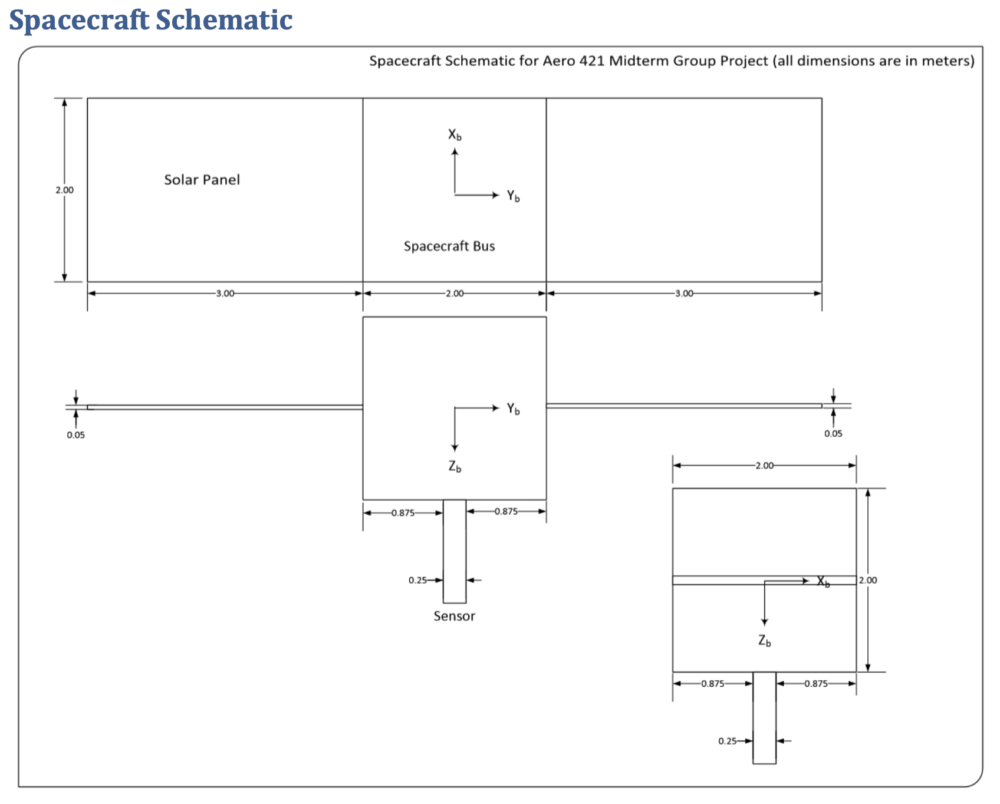
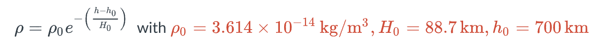

# **AERO - 421 Final Project Redevelopment**
**Spacecraft Attitude, Dynamics, and Control:** Simulation to determine and control a satellite's attitude in LEO.

## **Background**
AERO-421, or Spacecraft Attitude, Dynamics, and Controls, is a class taught at the California Polytechnic State University at San Luis Obispo (Cal Poly SLO) which serves as an...

> *"Introduction to spacecraft attitude dynamics and control... [and] fundamentals of guidance and navigation systems... [with emphasis in] analysis and design of control systems for aerospace vehicles." - Cal Poly Aerospace Engineering Course Catalog*

The final project in the course was to develop a simulation to determine a satellite's attitude in Low Earth Orbit (LEO), consider and model detumbling from a launch vehicle, consider and model disturbances due to external forces i.e., Solar Radiation Pressure (SRP), and to consider and model control via onboard reaction wheels. 

More information regarding the 6 different parts can be found below.

The initial project was developed in MATLAB, however, the project will be completely redeveloped in Python to showcase controls and software development skillsets.

Part 0: Context and Given Data

## **Part 0: Context and Given Data**
The project will explore modeling and simulation of the various stages of a spacecraft mission, specifically simulating the attitude dynamics from initial spacecraft deployment to operation. In this simulation, the spacecraft is an Earth observing satellite and an attitude determination and control system must be designed using reaction wheels to ensure the spacecraft maintains pointing nadir.

**Orbital Data:**
* *h* (angular momentum) *= 53335.2 km^2/s*
* *e* (eccentricity) *= 0*
* *Ω* (Right Ascension of Ascending Node) *= 0 deg*
* *i* (inclination) *= 98.43 deg*
* *ω* (Argument of Perigee) *= 0 deg*
* *θ* (True Anomaly) *= 0 deg*
* *ϵ-LVLH* (Initial Quaternion relating the body to the LVLH frame) *= [0, 0, 0]; η = 1*

**Detumble Phase:**
* Spacecraft is a square box with *2 meters* on each edge with total mass of *640 kg*
* Initial Angular Velocity of *[-0.05, 0.03, 0.2] rad/s* relating the body to the ECI frame

**Normal Operations:**
* Spacecraft bus is a *2 meter* cube with mass of *500 kg*. The center of mass of the spacecraft is located at the geometric center of the bus.
* A rectangular sensor is attached to the face pointing towards the Earth (+Z-axis) and is *1 meter* long and *0.25 meters* square. The sensor has a mass of *100 kg*.
* Two solar panels are deployed along the +/- Y-axis and are constrained to rotate about the +/- Y-axis. The solar panels are *3 meters* long (in the Y-axis), *2 meters* wide, and *0.05 meters* thick. Each panel has a mass of *20 kg* and the center of mass is located at the geometric center of the panel. The solar panels do not rotate relative to the spacecraft bus.
* Assume all spacecraft components have uniform density with centers of mass located at the geometric centers of each component
* Magnetically, the spacecraft residual magnetic dipole moment can be modeled as pointing in the -Z direction with magnitude *0.5 A-m^2*
* See the figure below for the spacecraft schematic
* Because the thrusters are not actually fully-modulated thrusters, the spacecraft will have a residual angular velocity of *[0.001, -0.001, 0.002] rad/s* relating the body to the ECI frame after the detumble phase.
* During operation the spacecraft is required to point at the target on the ground to within 0.001 degrees 3-sigma using the reaction wheels used in the reaction wheels part.

Part 1: Mass Properties

## **Part 1: Mass Properties**
Determine the mass and inertial properties of the spacecraft for both the detumble and the normal operations phases.

**Outputs:**
* Total mass of the spacecraft
* Center of mass relative to the spacecraft bus center of mass. The body frame will be located at the center of mass of the whole spacecraft
* Intertia matrix of the whole spacecraft about the center of mass of the spacecraft

Part 2: Torque Free Motion

## **Part 2: Torque Free Motion**
Model the torque free orbital and attitude motion of the spacecraft

**Outputs:**
Plots for...
* Euler angles and quaternions relating body to ECI reference frames
* Angular velocity of the spacecraft in body components for one orbit of the normal operations phase

Part 3: Detumble

## **Part 3: Detumble**
Simulate the motion of the satellite during the detumble phase. Assume fully modulated thrusters and use direct velocity feedback

**Outputs:**
Plots for... 
* Euler angles and quaternions relating body to ECI reference frames
* Angular velocity of the spacecraft in body components for the detumble phase
* Torque components in the body frame

Part 4: Disturbance Simulation

## **Part 4: Disturbance Simulation**
Add the four disturbance models to the simulation:
* Atmospheric Drag
* Solar Pressure
* Gravity Gradient
* Earth Magnetic Field

Use the following model for the atmospheric density. Notice that **h** is the height above the Earth's surface in **kilometers** where **R_Earth** equals **6378km**

Consider the simulation epoch to be March 20, 2021. Disregard any variations of the ECI representation of the sunlight direction during the simulation.

**Outputs:** Plots for...
* Euler angles and quaternions relating the body to the ECI reference frame
* Euler angles and quaternions relating the body to the LVLH reference frame
* Angular velocity of the spacecraft relative to the ECI frame expressed in body components
* Angular velocity of the spacecraft relative to the LVLH frame expressed in body components
* Torque components for atmospheric drag, solar radiation pressure, gravity gradient, and earth magnetic field

Part 5: Reaction Wheel Control

## **Part 5: Reaction Wheel Control**
Determine the control gains for a full state feedback 3-axis reaction wheel control system. Use the requirements of **ζ = 0.65** and **t_s = 30 sec**

The positions of the 3 reaction wheels are **[1, 0, 0]**, **[0, 1, 0]**, and **[0, 0, 1]**. Each reaction wheel can be modeled as a simple cylinder with **radius** of **0.3 m** and a **height** of **0.02 m**

**Outputs:** Plots for...
* Euler angles and quaternions relating the body to ECI reference frame
* Euler angles and quaternions relating the body to LVLH reference frame
* Angular velocity of the spacecraft relative to the ECI reference frame expressed in body components
* Angular velocity of the spacecraft relative to LVLH frame expressed in body components
* Commanded moment from the determined control law
* Wheel speed of each reaction wheel

Part 6: Visualization

## **Part 6: Visualization**
Determine and animate the quanterions of the spacecraft, from ECI to body frame, for the duration of 1-5 revolutions. 

**Output**:
* Table of quaternion and time data
* Video or other animation file to show the revolution of the spacecraft

